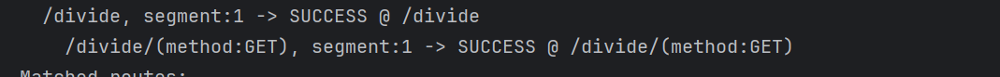

# Server-qts
Atividade proposta é uma calculadora, onde ela é testada com uma API e foi realizado testes unitários.

# Projeto QTS - Sistema de Testes e Automação

Este é um projeto desenvolvido para a implementação de uma calculadora e testes automatizados utilizando Gradle e Kotlin. O objetivo principal é fornecer uma API de calculadora que pode ser testada por meio de testes unitários e de integração.

## Estrutura do Projeto

O projeto está estruturado da seguinte forma:

- *src/*: Contém o código-fonte do projeto.
- *build.gradle*: Arquivo de configuração do Gradle, que define dependências e configurações do projeto.
- *tests/*: Contém os testes automatizados da calculadora.
- *README.md*: Este arquivo com informações sobre o projeto.

## Funcionalidades

Este projeto inclui uma calculadora simples com as seguintes funcionalidades:

- *Adição*
- *Subtração*
- *Multiplicação*
- *Divisão*

Essas funcionalidades são testadas usando testes unitários, e o processo de integração também foi automatizado para garantir a integridade do sistema.

## Como Rodar o Projeto

1. *Clonar o repositório*

   Para começar, clone este repositório em sua máquina local:

   bash
   git clone https://github.com/usuario/nome-do-repositorio.git
   cd nome-do-repositorio

   Compilar e rodar o projeto com Gradle

2. Para compilar e executar o projeto, utilize o Gradle no terminal:

 bash
```
./gradlew build
 ```

Este comando vai compilar o projeto, rodar os testes e gerar os artefatos finais.

Rodar os testes

Para rodar os testes automatizados, use:
bash
```
./gradlew test
```
# Evidências dos Testes Unitários

Este documento apresenta as evidências dos testes unitários realizados em cada rota da API. As imagens anexadas mostram os resultados obtidos.

## Rota: `Adição`


## Rota: `Subtração`


## Rota: `Multiplicação`


## Rota: `Divisão`


## Rota: `Divisão por zero`


